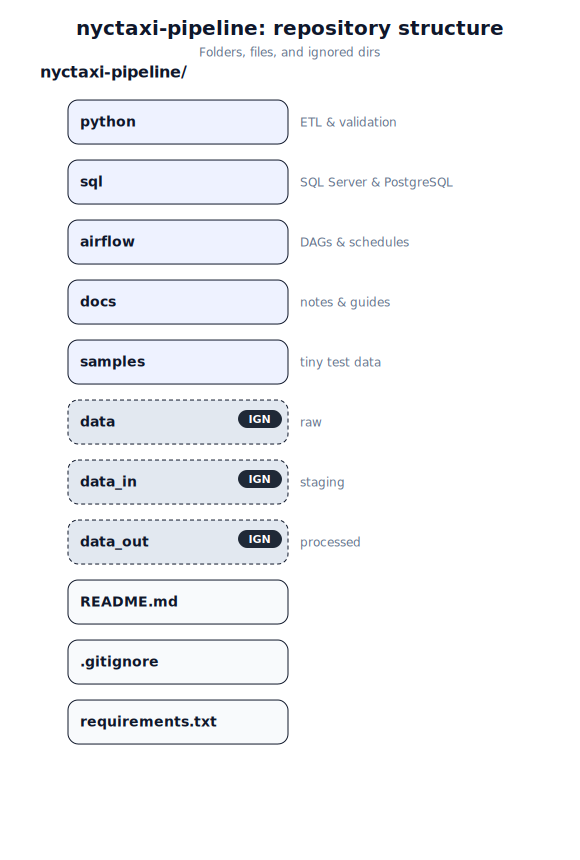

# NYC Taxi Data Pipeline

This project builds a **reproducible data pipeline** for the NYC Taxi & Limousine Commission (TLC) trip records dataset.  
It demonstrates how raw data can be ingested, validated, transformed, and made analytics-ready across multiple platforms.

---

## ✨ Features
- **Ingestion**: Bulk import of TLC Parquet → PSV/CSV → SQL Server (2019/2022) & PostgreSQL  
- **Validation**: Python scripts for schema and data quality checks  
- **Transformation**: SQL stored procedures + Airflow DAGs  
- **Analytics**: Aggregations in SQL Server / Databricks (Delta Lake / Medallion architecture)  
- **Visualization**: Power BI dashboards for insights  

---

## 📂 Repository Structure

